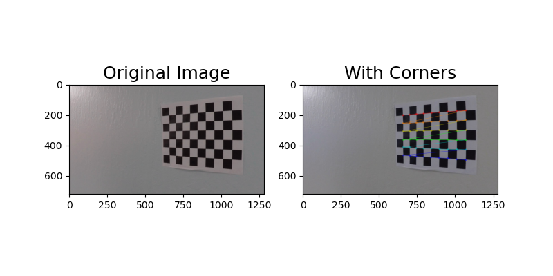

# Advanced Lane Finding

In this project, the goal is to write a software pipeline to identify the lane boundaries in a video, but the main output or product we want you to create is a detailed writeup of the project.  

## The goals this project are the following:

* Compute the camera calibration matrix and distortion coefficients given a set of chessboard images.
* Apply a distortion correction to raw images.
* Use color transforms, gradients, etc., to create a thresholded binary image.
* Apply a perspective transform to rectify binary image ("birds-eye view").
* Detect lane pixels and fit to find the lane boundary.
* Determine the curvature of the lane and vehicle position with respect to center.
* Warp the detected lane boundaries back onto the original image.
* Output visual display of the lane boundaries and numerical estimation of lane curvature and vehicle position.

The images for camera calibration are stored in the folder called `camera_cal`.  The images in `test_images` are for testing your pipeline on single frames.  If you want to extract more test images from the videos, you can simply use an image writing method like `cv2.imwrite()`, i.e., you can read the video in frame by frame as usual, and for frames you want to save for later you can write to an image file.  

To help the reviewer examine your work, please save examples of the output from each stage of your pipeline in the folder called `output_images`, and include a description in your writeup for the project of what each image shows.    The video called `project_video.mp4` is the video your pipeline should work well on.  

The `challenge_video.mp4` video is an extra (and optional) challenge for you if you want to test your pipeline under somewhat trickier conditions.  

### Step 1: Chessboard Images
In the first step, this study used the OpenCV functions `findChessboardCorners` and `drawChessboardCorners` to identify the locations of corners on a series of pictures of a chessboard taken from different angles.

Next, the locations of the chessboard corners were used as input to the OpenCV function `calibrateCamera` to compute the camera calibration matrix and distortion coefficients. 

### Step 2: Undistorted Images
In the second step, the camera calibration matrix and distortion coefficients were used with the OpenCV function `undistort` to remove distortion from highway driving images.

Notice that if you compare the two images, especially around the edges, there are obvious differences between the original and undistorted image, indicating that distortion has been removed from the original image.

### Step 3: Perspective Transform
To get undistorted images, 'cv2.undistort' is used, which will get arguments from cv2.calibrateCamera like the distortion coefficient, the camera matrix to return a undistorted image.The goal of this step is to transform the undistorted image to a "birds eye view" of the road which focuses only on the lane lines and displays them in such a way that they appear to be relatively parallel to eachother (as opposed to the converging lines you would normally see). To achieve the perspective transformation I first applied the OpenCV functions `getPerspectiveTransform` and `warpPerspective` which take a matrix of four source points on the undistorted image and remaps them to four destination points on the warped image. The source and destination points were selected manually by visualizing the locations of the lane lines on a series of test images.

### Step 4: Binary Thresholds
In this step I attempted to convert the warped image to different color spaces and create binary thresholded images which highlight only the lane lines and ignore everything else. 
I found that the following color channels and thresholds did a good job of identifying the lane lines in the provided test images:
- The S Channel from the HLS color space, with a min threshold of 180 and a max threshold of 255, did a fairly good job of identifying both the white and yellow lane lines, but did not pick up 100% of the pixels in either one, and had a tendency to get distracted by shadows on the road.
- The L Channel from the LUV color space, with a min threshold of 225 and a max threshold of 255, did an almost perfect job of picking up the white lane lines, but completely ignored the yellow lines.
- The B channel from the Lab color space, with a min threshold of 155 and an upper threshold of 200, did a better job than the S channel in identifying the yellow lines, but completely ignored the white lines. 

I chose to create a combined binary threshold based on the three above mentioned binary thresholds, to create one combination thresholded image which does a great job of highlighting almost all of the white and yellow lane lines.

### Steps 5: Polynomial Fitting & Curvature Calculation:
At this point I was able to use the combined binary image to isolate only the pixels belonging to lane lines. The next step was to fit a polynomial to each lane line, which was done by:
- Identifying peaks in a histogram of the image to determine location of lane lines.
- Identifying all non zero pixels around histogram peaks using the numpy function `numpy.nonzero()`.
- Fitting a polynomial to each lane using the numpy function `numpy.polyfit()`.

After fitting the polynomials I was able to calculate the position of the vehicle with respect to center with the following calculations:
- Calculated the average of the x intercepts from each of the two polynomials `position = (rightx_int+leftx_int)/2`
- Calculated the distance from center by taking the absolute value of the vehicle position minus the halfway point along the horizontal axis `distance_from_center = abs(image_width/2 - position)`
- If the horizontal position of the car was greater than `image_width/2` than the car was considered to be left of center, otherwise right of center.
- Finally, the distance from center was converted from pixels to meters by multiplying the number of pixels by `3.7/700`.

### Step 6: Marked Lane & Position Estimation
The final step in processing the images was to plot the polynomials on to the warped image, fill the space between the polynomials to highlight the lane that the car is in, use another perspective trasformation to unwarp the image from birds eye back to its original perspective, and print the distance from center and radius of curvature on to the final annotated image.
In this part, the combined binary images are used to pick upo the pixels to fit a polynomial to each lane line. And the lane will be marked with green color. Moreover, the radius of the curvature will be calculated.

## Video Processing Pipeline:

By using a pipeline to process video frame-by-frame, the final results are shown as below:

|Project Video|Challenge Video|
|-------------|-------------|
|||